# STORY.md — Narrative Structure & Branching Logic

> **Owner:** Agent B (Narrative Designer)
> **Status:** MVP Draft
> **Last Updated:** 2025-12-28

This document defines the story structure, endings, dependencies, and critical decision points for the gamebook adaptation. It serves as the canonical reference for narrative integrity and branching logic.

---

## Table of Contents

1. [Story Overview](#story-overview)
2. [Endings](#endings)
3. [Dependency Matrix](#dependency-matrix)
4. [Critical Nodes](#critical-nodes)
5. [Story Flow Diagram](#story-flow-diagram)

---

## Story Overview

The game spans **3 acts** with approximately **165 total nodes**. The narrative branches based on:
- **Faction alignment** (tracked via thresholds)
- **Flags** (binary state triggers set by choices)
- **Items** (inventory-based gating)
- **Ally relationships** (NPCs recruited/lost)

### Act Structure

| Act | Focus | Approx. Nodes | Key Mechanics |
|-----|-------|---------------|---------------|
| Act 1 | Introduction & Faction Choice | ~45 | Initial flags, first ally recruitment |
| Act 2 | Rising Action & Alliances | ~64 | Faction reputation, item collection |
| Act 3 | Climax & Resolution | ~56 | Ending triggers, final confrontation |

---

## Endings

The game has **5 distinct endings**. Each ending requires specific conditions to trigger.

### Ending 1: Victory (Faction-Aligned)

**Description:** The player achieves their faction's ultimate goal, emerging as a hero of their chosen side.

**Requirements:**
| Condition Type | Requirement |
|----------------|-------------|
| Faction | Alignment ≥ 75 with chosen faction |
| Flags | `FACTION_LEADER_MET`, `FINAL_QUEST_ACCEPTED` |
| Items | Faction artifact (varies by faction) |
| Allies | At least 2 faction-aligned allies alive |

**Trigger Node:** `ACT3_END_VICTORY`

---

### Ending 2: Sacrifice

**Description:** The player sacrifices themselves to save others, achieving a bittersweet resolution.

**Requirements:**
| Condition Type | Requirement |
|----------------|-------------|
| Flags | `SACRIFICE_PATH_UNLOCKED`, `LOVED_ONE_IN_DANGER` |
| Items | `ITEM_SACRED_AMULET` |
| Allies | At least 1 ally alive to save |
| Choice | Select sacrifice option at final confrontation |

**Trigger Node:** `ACT3_END_SACRIFICE`

---

### Ending 3: Betrayal

**Description:** The player betrays their allies for personal gain, becoming the new antagonist.

**Requirements:**
| Condition Type | Requirement |
|----------------|-------------|
| Faction | Alignment < 25 with all factions OR `BETRAYER_PATH` flag |
| Flags | `SECRET_DEAL_MADE`, `ANTAGONIST_OFFER_ACCEPTED` |
| Items | `ITEM_DARK_PACT_SCROLL` |
| Allies | All allies either dead or betrayed |

**Trigger Node:** `ACT3_END_BETRAYAL`

---

### Ending 4: Neutral

**Description:** The player walks away, neither hero nor villain, leaving the conflict unresolved.

**Requirements:**
| Condition Type | Requirement |
|----------------|-------------|
| Faction | Alignment 25-50 with all factions (no strong allegiance) |
| Flags | `NEUTRAL_PATH_AVAILABLE` (set if no major faction commitments) |
| Items | None required |
| Allies | None required |

**Trigger Node:** `ACT3_END_NEUTRAL`

---

### Ending 5: Death

**Description:** The player dies during the final confrontation, failing to achieve any goal.

**Requirements:**
| Condition Type | Requirement |
|----------------|-------------|
| Stats | Health reaches 0 during final battle |
| OR Flags | `DOOM_SEALED` (unrecoverable state from critical failures) |
| Items | Missing required survival items |
| Allies | No allies available to rescue |

**Trigger Node:** `ACT3_END_DEATH`

---

## Dependency Matrix

This section maps the relationships between items, flags, faction thresholds, and what they unlock.

### Items → Path Unlocks

| Item ID | Item Name | Acquired In | Unlocks |
|---------|-----------|-------------|---------|
| `ITEM_FACTION_A_ARTIFACT` | Crown of the North | Act 2, Node `ACT2_ARTIFACT_A` | Victory ending (Faction A path) |
| `ITEM_FACTION_B_ARTIFACT` | Blade of Shadows | Act 2, Node `ACT2_ARTIFACT_B` | Victory ending (Faction B path) |
| `ITEM_FACTION_C_ARTIFACT` | Staff of Ages | Act 2, Node `ACT2_ARTIFACT_C` | Victory ending (Faction C path) |
| `ITEM_SACRED_AMULET` | Sacred Amulet | Act 1, Node `ACT1_SHRINE` | Sacrifice ending path |
| `ITEM_DARK_PACT_SCROLL` | Dark Pact Scroll | Act 2, Node `ACT2_SECRET_DEAL` | Betrayal ending path |
| `ITEM_SURVIVAL_KIT` | Survival Kit | Act 1, Node `ACT1_SUPPLIES` | Prevents Death ending (survival check) |
| `ITEM_MAP_FRAGMENT_1` | Map Fragment (North) | Act 1, Node `ACT1_EXPLORE_1` | Unlocks `ACT2_HIDDEN_PATH` |
| `ITEM_MAP_FRAGMENT_2` | Map Fragment (South) | Act 2, Node `ACT2_EXPLORE_2` | Unlocks `ACT3_SECRET_ENTRANCE` |
| `ITEM_KEY_VAULT` | Vault Key | Act 2, Node `ACT2_HEIST` | Unlocks `ACT2_VAULT` treasure room |

### Flags → Branch Unlocks

| Flag ID | Set By | Unlocks/Affects |
|---------|--------|-----------------|
| `FACTION_A_JOINED` | `ACT1_FACTION_CHOICE` | Faction A quest line, A-aligned allies |
| `FACTION_B_JOINED` | `ACT1_FACTION_CHOICE` | Faction B quest line, B-aligned allies |
| `FACTION_C_JOINED` | `ACT1_FACTION_CHOICE` | Faction C quest line, C-aligned allies |
| `FACTION_LEADER_MET` | `ACT2_LEADER_AUDIENCE` | Victory ending prereq |
| `FINAL_QUEST_ACCEPTED` | `ACT2_QUEST_DECISION` | Victory ending prereq |
| `SACRIFICE_PATH_UNLOCKED` | `ACT2_PROPHECY` | Sacrifice ending available |
| `LOVED_ONE_IN_DANGER` | `ACT3_KIDNAPPING` | Sacrifice ending prereq |
| `BETRAYER_PATH` | `ACT2_TEMPTATION` | Betrayal ending available |
| `SECRET_DEAL_MADE` | `ACT2_SECRET_DEAL` | Betrayal ending prereq |
| `ANTAGONIST_OFFER_ACCEPTED` | `ACT3_FINAL_OFFER` | Betrayal ending prereq |
| `NEUTRAL_PATH_AVAILABLE` | Auto-set if no faction ≥50 | Neutral ending available |
| `DOOM_SEALED` | `ACT3_CRITICAL_FAILURE` | Forces Death ending |
| `ALLY_MARCUS_ALIVE` | Default true, cleared on death | Affects ending availability |
| `ALLY_ELENA_ALIVE` | Default true, cleared on death | Affects ending availability |
| `ALLY_THORNE_ALIVE` | Recruited in Act 2 | Affects ending availability |

### Faction Thresholds

| Faction | Threshold | Effect |
|---------|-----------|--------|
| Faction A | ≥75 | Victory (A) ending available |
| Faction A | ≥50 | Leader audience granted |
| Faction A | <25 | A-aligned allies may leave |
| Faction B | ≥75 | Victory (B) ending available |
| Faction B | ≥50 | Leader audience granted |
| Faction B | <25 | B-aligned allies may leave |
| Faction C | ≥75 | Victory (C) ending available |
| Faction C | ≥50 | Leader audience granted |
| Faction C | <25 | C-aligned allies may leave |
| All Factions | <25 | Betrayal path opens |
| All Factions | 25-50 | Neutral ending available |

---

## Critical Nodes

These are the 25 most important decision points that shape the narrative. Each node is documented with its branching logic.

### Act 1: Introduction & Faction Choice

| Node ID | Title | Type | Branches To | Flags/Effects |
|---------|-------|------|-------------|---------------|
| `ACT1_START` | Awakening | Start | `ACT1_FIRST_CHOICE` | None |
| `ACT1_FIRST_CHOICE` | First Steps | Decision | `ACT1_PATH_A`, `ACT1_PATH_B` | Sets initial tone |
| `ACT1_FACTION_CHOICE` | The Three Paths | Major Decision | `ACT1_FACTION_A_INTRO`, `ACT1_FACTION_B_INTRO`, `ACT1_FACTION_C_INTRO` | Sets `FACTION_X_JOINED` |
| `ACT1_SHRINE` | Ancient Shrine | Optional | `ACT1_CONTINUE` | Grants `ITEM_SACRED_AMULET` |
| `ACT1_SUPPLIES` | Gathering Supplies | Optional | `ACT1_CONTINUE` | Grants `ITEM_SURVIVAL_KIT` |
| `ACT1_ALLY_MARCUS` | Meeting Marcus | Ally | `ACT1_MARCUS_JOIN`, `ACT1_MARCUS_LEAVE` | `ALLY_MARCUS_ALIVE` |
| `ACT1_EXPLORE_1` | Northern Exploration | Optional | `ACT1_CONTINUE` | Grants `ITEM_MAP_FRAGMENT_1` |
| `ACT1_ACT_END` | End of Beginning | Transition | `ACT2_START` | Locks faction choice |

### Act 2: Rising Action & Alliances

| Node ID | Title | Type | Branches To | Flags/Effects |
|---------|-------|------|-------------|---------------|
| `ACT2_START` | New Horizons | Start | Varies by faction | None |
| `ACT2_LEADER_AUDIENCE` | Audience with Leader | Major | `ACT2_QUEST_OFFER`, `ACT2_REJECTED` | Sets `FACTION_LEADER_MET` |
| `ACT2_QUEST_DECISION` | The Great Quest | Major Decision | `ACT2_ACCEPT_QUEST`, `ACT2_REFUSE_QUEST` | Sets `FINAL_QUEST_ACCEPTED` |
| `ACT2_ARTIFACT_A/B/C` | Claiming the Artifact | Faction-specific | `ACT2_ARTIFACT_OBTAINED` | Grants faction artifact |
| `ACT2_TEMPTATION` | Dark Whispers | Moral Choice | `ACT2_RESIST`, `ACT2_EMBRACE` | May set `BETRAYER_PATH` |
| `ACT2_SECRET_DEAL` | The Shadow Broker | Hidden | `ACT2_DEAL_MADE`, `ACT2_DEAL_REFUSED` | Grants `ITEM_DARK_PACT_SCROLL`, sets `SECRET_DEAL_MADE` |
| `ACT2_PROPHECY` | The Seer's Vision | Story | `ACT2_CONTINUE` | Sets `SACRIFICE_PATH_UNLOCKED` |
| `ACT2_ALLY_ELENA` | Elena's Plea | Ally | `ACT2_ELENA_SAVED`, `ACT2_ELENA_LOST` | `ALLY_ELENA_ALIVE` |
| `ACT2_ALLY_THORNE` | Thorne's Offer | Ally | `ACT2_THORNE_JOIN`, `ACT2_THORNE_REFUSE` | `ALLY_THORNE_ALIVE` |
| `ACT2_HEIST` | The Vault Job | Optional | `ACT2_VAULT`, `ACT2_CAUGHT` | Grants `ITEM_KEY_VAULT` |
| `ACT2_ACT_END` | Storm Clouds | Transition | `ACT3_START` | Faction alignment locked |

### Act 3: Climax & Resolution

| Node ID | Title | Type | Branches To | Flags/Effects |
|---------|-------|------|-------------|---------------|
| `ACT3_START` | The Final Push | Start | `ACT3_APPROACH` | None |
| `ACT3_KIDNAPPING` | Taken | Crisis | `ACT3_RESCUE_ATTEMPT`, `ACT3_IGNORE` | Sets `LOVED_ONE_IN_DANGER` |
| `ACT3_FINAL_OFFER` | The Antagonist's Deal | Major Decision | `ACT3_ACCEPT_OFFER`, `ACT3_REFUSE` | May set `ANTAGONIST_OFFER_ACCEPTED` |
| `ACT3_CRITICAL_FAILURE` | Point of No Return | Failure State | `ACT3_END_DEATH` | Sets `DOOM_SEALED` |
| `ACT3_FINAL_CONFRONTATION` | The Last Battle | Climax | All endings | Checks all ending conditions |
| `ACT3_END_VICTORY` | Victory | Ending | Credits | Ending 1 |
| `ACT3_END_SACRIFICE` | Sacrifice | Ending | Credits | Ending 2 |
| `ACT3_END_BETRAYAL` | Betrayal | Ending | Credits | Ending 3 |
| `ACT3_END_NEUTRAL` | Walking Away | Ending | Credits | Ending 4 |
| `ACT3_END_DEATH` | Fallen | Ending | Game Over | Ending 5 |

---

## Story Flow Diagram

```mermaid
flowchart TD
    subgraph ACT1["Act 1: Introduction"]
        A1_START[ACT1_START<br/>Awakening]
        A1_FACTION[ACT1_FACTION_CHOICE<br/>The Three Paths]
        A1_FA[Faction A Path]
        A1_FB[Faction B Path]
        A1_FC[Faction C Path]
        A1_END[ACT1_ACT_END]

        A1_START --> A1_FACTION
        A1_FACTION --> A1_FA
        A1_FACTION --> A1_FB
        A1_FACTION --> A1_FC
        A1_FA --> A1_END
        A1_FB --> A1_END
        A1_FC --> A1_END
    end

    subgraph ACT2["Act 2: Rising Action"]
        A2_START[ACT2_START]
        A2_LEADER[ACT2_LEADER_AUDIENCE]
        A2_QUEST[ACT2_QUEST_DECISION]
        A2_TEMPT[ACT2_TEMPTATION<br/>Betrayal Path?]
        A2_PROPHECY[ACT2_PROPHECY<br/>Sacrifice Path?]
        A2_END[ACT2_ACT_END]

        A2_START --> A2_LEADER
        A2_LEADER --> A2_QUEST
        A2_QUEST --> A2_TEMPT
        A2_TEMPT --> A2_PROPHECY
        A2_PROPHECY --> A2_END
    end

    subgraph ACT3["Act 3: Climax"]
        A3_START[ACT3_START]
        A3_FINAL[ACT3_FINAL_CONFRONTATION]

        E1[Victory]
        E2[Sacrifice]
        E3[Betrayal]
        E4[Neutral]
        E5[Death]

        A3_START --> A3_FINAL
        A3_FINAL --> E1
        A3_FINAL --> E2
        A3_FINAL --> E3
        A3_FINAL --> E4
        A3_FINAL --> E5
    end

    A1_END --> A2_START
    A2_END --> A3_START

    style E1 fill:#4CAF50
    style E2 fill:#9C27B0
    style E3 fill:#F44336
    style E4 fill:#607D8B
    style E5 fill:#212121
```

---

## Ending Conditions Summary

Quick reference for which flags/items/factions unlock each ending:

```mermaid
flowchart LR
    subgraph CONDITIONS["Ending Conditions"]
        V[Victory] --> V1[Faction ≥75]
        V --> V2[FACTION_LEADER_MET]
        V --> V3[FINAL_QUEST_ACCEPTED]
        V --> V4[Faction Artifact]
        V --> V5[2+ Allies Alive]

        S[Sacrifice] --> S1[SACRIFICE_PATH_UNLOCKED]
        S --> S2[LOVED_ONE_IN_DANGER]
        S --> S3[ITEM_SACRED_AMULET]

        B[Betrayal] --> B1[All Factions <25 OR BETRAYER_PATH]
        B --> B2[SECRET_DEAL_MADE]
        B --> B3[ANTAGONIST_OFFER_ACCEPTED]
        B --> B4[ITEM_DARK_PACT_SCROLL]

        N[Neutral] --> N1[All Factions 25-50]
        N --> N2[NEUTRAL_PATH_AVAILABLE]

        D[Death] --> D1[Health = 0]
        D --> D2[OR DOOM_SEALED]
    end

    style V fill:#4CAF50
    style S fill:#9C27B0
    style B fill:#F44336
    style N fill:#607D8B
    style D fill:#212121
```

---

## Notes for Implementation

1. **Node ID Convention:** `ACT{1-3}_{TYPE}_{NAME}` where TYPE is one of: START, END, DECISION, ALLY, ITEM, STORY
2. **Flag Naming:** `SCREAMING_SNAKE_CASE` with descriptive names
3. **Faction Alignment:** Integer 0-100, starts at 50 for all factions
4. **Ally Tracking:** Boolean flags, default true for starting allies

---

*This document will be expanded as the source gamebook analysis continues. Phase 2 will add the complete 165-node index if required by engine implementation.*
