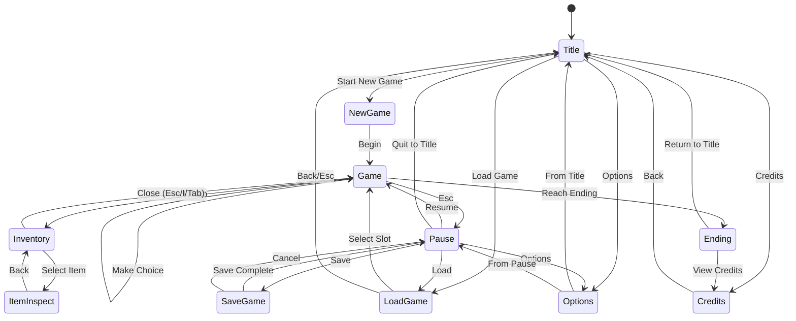

# UI Specification

> DOS-style User Interface Design for Gamebook Web

## Table of Contents

1. [Screen Flow Overview](#screen-flow-overview)
2. [Terminal Constraints](#terminal-constraints)
3. [Visual Language](#visual-language)
4. [Keyboard Interaction Model](#keyboard-interaction-model)
5. [Screen Specifications](#screen-specifications)
6. [Component Patterns](#component-patterns)
7. [Error States](#error-states)
8. [Accessibility](#accessibility)

---

## Screen Flow Overview



### Screen Hierarchy

| Screen | Parent | Purpose |
|--------|--------|---------|
| Title | - | Main menu entry point |
| New Game | Title | Start fresh playthrough |
| Load Game | Title, Pause | Select saved game slot |
| Game | - | Main gameplay screen |
| Pause | Game | In-game menu overlay |
| Save Game | Pause | Save to slot |
| Inventory | Game | View/manage items |
| Item Inspect | Inventory | Detailed item view |
| Options | Title, Pause | Audio/display settings |
| Ending | Game | Win/lose conclusion |
| Credits | Title, Ending | Attribution screen |

---

## Terminal Constraints

### Minimum Requirements

| Property | Value | Notes |
|----------|-------|-------|
| Min Width | 80 characters | Classic DOS terminal width |
| Min Height | 24 lines | Classic DOS terminal height |
| Recommended | 80x25 | Standard VGA text mode |
| Max Width | 120 characters | Wide terminal support |
| Max Height | 40 lines | Extended display |

### Responsive Behavior

- **< 80 chars wide**: Display warning, horizontal scroll disabled
- **80-120 chars**: Content centered, max-width container
- **> 120 chars**: Fixed 120-char content area, margins on sides

### Layout Grid

```
┌──────────────────────────────────────────────────────────────────────────────┐
│ HEADER (2 lines)                                                             │
├──────────────────────────────────────────────────────────────────────────────┤
│                                                                              │
│ MAIN CONTENT AREA (18 lines)                                                 │
│                                                                              │
│                                                                              │
│                                                                              │
├──────────────────────────────────────────────────────────────────────────────┤
│ STATUS BAR (1 line)                                                          │
├──────────────────────────────────────────────────────────────────────────────┤
│ INPUT/CHOICES (3 lines)                                                      │
└──────────────────────────────────────────────────────────────────────────────┘
```

---

## Visual Language

### Color Palette

DOS-inspired 16-color palette with specific hex values:

| Name | Hex | RGB | Usage |
|------|-----|-----|-------|
| Black | `#000000` | 0, 0, 0 | Primary background |
| Dark Blue | `#0000AA` | 0, 0, 170 | Secondary backgrounds |
| Dark Green | `#00AA00` | 0, 170, 0 | Success states |
| Dark Cyan | `#00AAAA` | 0, 170, 170 | Links, interactive |
| Dark Red | `#AA0000` | 170, 0, 0 | Errors, warnings |
| Dark Magenta | `#AA00AA` | 170, 0, 170 | Special items |
| Brown | `#AA5500` | 170, 85, 0 | Borders, frames |
| Light Gray | `#AAAAAA` | 170, 170, 170 | Secondary text |
| Dark Gray | `#555555` | 85, 85, 85 | Disabled text |
| Light Blue | `#5555FF` | 85, 85, 255 | Highlights |
| Light Green | `#55FF55` | 85, 255, 85 | Active selection |
| Light Cyan | `#55FFFF` | 85, 255, 255 | Emphasis |
| Light Red | `#FF5555` | 255, 85, 85 | Critical alerts |
| Light Magenta | `#FF55FF` | 255, 85, 255 | Rare items |
| Yellow | `#FFFF55` | 255, 255, 85 | Warnings, gold |
| White | `#FFFFFF` | 255, 255, 255 | Primary text |

### Color Combinations

| Context | Foreground | Background | Notes |
|---------|------------|------------|-------|
| Default text | White | Black | High contrast |
| Selected item | Black | Light Green | Inverted for visibility |
| Disabled item | Dark Gray | Black | Reduced contrast |
| Error message | Light Red | Black | Attention-grabbing |
| Success message | Light Green | Black | Positive feedback |
| Border/frame | Brown | Black | Subtle structure |
| Header | Yellow | Dark Blue | Title emphasis |
| Input prompt | Light Cyan | Black | Action indicator |

### Color-Blind Considerations

- Never rely solely on color to convey information
- All states include text labels or symbols
- Selected items use `►` marker in addition to color
- Error states include `[!]` prefix
- Success states include `[✓]` prefix
- Disabled items show `[-]` or strikethrough pattern

### Typography

**Primary Font**: Monospace/bitmap-style
- Recommended: DOS-style bitmap font (8x16 or similar)
- Web fallback: `"Consolas", "Monaco", "Courier New", monospace`
- Line height: 1.0 (tight, authentic)
- Letter spacing: 0 (fixed-width)

**Text Styles**:

| Style | Rendering | Usage |
|-------|-----------|-------|
| Normal | Plain text | Body content |
| Bold | UPPERCASE or `*asterisks*` | Emphasis, headers |
| Highlight | `[bracketed]` | Interactive elements |
| Dim | Lowercase, gray | Secondary info |

### Box Drawing Characters

```
Single Line:
┌─────┐
│     │
└─────┘

Double Line:
╔═════╗
║     ║
╚═════╝

Mixed (for emphasis):
╔═════╗
║ HDR ║
╠═════╣
│ body│
└─────┘
```

| Character | Code | Usage |
|-----------|------|-------|
| `─` | U+2500 | Horizontal line |
| `│` | U+2502 | Vertical line |
| `┌` | U+250C | Top-left corner |
| `┐` | U+2510 | Top-right corner |
| `└` | U+2514 | Bottom-left corner |
| `┘` | U+2518 | Bottom-right corner |
| `├` | U+251C | Left T-junction |
| `┤` | U+2524 | Right T-junction |
| `┬` | U+252C | Top T-junction |
| `┴` | U+2534 | Bottom T-junction |
| `┼` | U+253C | Cross junction |
| `═` | U+2550 | Double horizontal |
| `║` | U+2551 | Double vertical |
| `╔` | U+2554 | Double top-left |
| `╗` | U+2557 | Double top-right |
| `╚` | U+255A | Double bottom-left |
| `╝` | U+255D | Double bottom-right |

### Spacing

- **Padding inside boxes**: 1 character horizontal, 0 vertical
- **Margin between elements**: 1 blank line
- **Indentation**: 2 spaces per level

---

## Keyboard Interaction Model

### Global Controls

| Key | Action | Context |
|-----|--------|---------|
| `↑` / `W` | Move selection up | All menus |
| `↓` / `S` | Move selection down | All menus |
| `←` / `A` | Decrease value / Previous | Sliders, tabs |
| `→` / `D` | Increase value / Next | Sliders, tabs |
| `Enter` / `Space` | Confirm selection | All contexts |
| `Esc` | Back / Cancel / Pause | All contexts |
| `Tab` | Next focus area | Multi-panel screens |
| `Shift+Tab` | Previous focus area | Multi-panel screens |

### Game Screen Controls

| Key | Action |
|-----|--------|
| `1-9` | Quick-select choice by number |
| `I` | Open inventory |
| `Tab` | Open inventory (alternate) |
| `Esc` | Open pause menu |
| `PgUp` | Scroll text up |
| `PgDn` | Scroll text down |
| `Home` | Scroll to top |
| `End` | Scroll to bottom |

### Inventory Controls

| Key | Action |
|-----|--------|
| `↑↓` | Navigate items |
| `Enter` | Inspect selected item |
| `U` | Use selected item |
| `Esc` / `I` | Close inventory |

### Audio Controls (Options Screen)

| Key | Action |
|-----|--------|
| `M` | Toggle mute |
| `+` / `=` | Increase volume |
| `-` | Decrease volume |

### Visual Feedback

**Selection Indicator**:
```
  Option 1
► Option 2  ← Currently selected (highlighted + marker)
  Option 3
```

**Focus States**:
- Focused: Bright border (`═`)
- Unfocused: Dim border (`─`)
- Disabled: No border or dotted (`┄`)

---

## Screen Specifications

### Title Screen

```
╔══════════════════════════════════════════════════════════════════════════════╗
║                                                                              ║
║                                                                              ║
║                     ████  █████ █   █ █████ ████   ███  ███  █   █           ║
║                    █      █   █ ██ ██ █     █   █ █   █ █  █ █  █            ║
║                    █  ██  █████ █ █ █ ████  ████  █   █ █  █ ██              ║
║                    █   █  █   █ █   █ █     █   █ █   █ █  █ █  █            ║
║                     ████  █   █ █   █ █████ ████   ███  ███  █   █           ║
║                                                                              ║
║                                                                              ║
╠══════════════════════════════════════════════════════════════════════════════╣
│                                                                              │
│                           ► NEW GAME                                         │
│                             LOAD GAME                                        │
│                             OPTIONS                                          │
│                             CREDITS                                          │
│                                                                              │
│                                                                              │
└──────────────────────────────────────────────────────────────────────────────┘
                         Press ENTER to select
```

### Game Screen

```
╔══════════════════════════════════════════════════════════════════════════════╗
║ Chapter 3: The Dark Forest                                           [I]nv  ║
╠══════════════════════════════════════════════════════════════════════════════╣
│                                                                              │
│  You stand at the edge of the ancient forest. The trees tower above you,    │
│  their gnarled branches blocking out most of the moonlight. A narrow path   │
│  winds into the darkness ahead.                                             │
│                                                                              │
│  From somewhere deep within, you hear the sound of running water. The air   │
│  is thick with the scent of moss and decay.                                 │
│                                                                              │
│  Your torch flickers in the breeze.                                         │
│                                                                              │
│                                                                              │
│                                                                              │
├──────────────────────────────────────────────────────────────────────────────┤
│ HP: ████████░░ 80/100    Gold: 45    Torch: 3 remaining                      │
├──────────────────────────────────────────────────────────────────────────────┤
│  [1] ► Follow the path into the forest                                      │
│  [2]   Search the area for another way                                      │
│  [3]   Light a new torch before proceeding                                  │
└──────────────────────────────────────────────────────────────────────────────┘
```

### Inventory Screen (Overlay)

```
┌─────────────────────────────── INVENTORY ────────────────────────────────────┐
│                                                                              │
│  ITEMS                           │  DETAILS                                  │
│  ─────                           │  ───────                                  │
│  ► Rusty Sword              [E]  │  RUSTY SWORD                              │
│    Health Potion (x3)            │  ──────────────                           │
│    Old Map                       │  A weathered blade showing signs          │
│    Silver Key                    │  of age. Still sharp enough to            │
│    Torch (x3)                    │  be dangerous.                            │
│                                  │                                           │
│                                  │  ATK: +5                                  │
│                                  │  Equipped: Yes                            │
│                                  │                                           │
│                                  │  [U]se  [D]rop  [Esc] Close               │
│                                  │                                           │
├──────────────────────────────────┴───────────────────────────────────────────┤
│  ↑↓ Navigate    Enter: Inspect    U: Use    Esc/I: Close                     │
└──────────────────────────────────────────────────────────────────────────────┘
```

### Save/Load Screen

```
╔════════════════════════════════ SAVE GAME ═══════════════════════════════════╗
║                                                                              ║
║  Select a slot to save your progress:                                        ║
║                                                                              ║
║  ┌─────────────────────────────────────────────────────────────────────────┐ ║
║  │ ► SLOT 1: Chapter 3 - The Dark Forest         2024-01-15 14:32          │ ║
║  │           HP: 80/100  Gold: 45  Time: 1:23:45                           │ ║
║  ├─────────────────────────────────────────────────────────────────────────┤ ║
║  │   SLOT 2: Chapter 1 - The Beginning           2024-01-14 10:15          │ ║
║  │           HP: 100/100  Gold: 10  Time: 0:15:30                          │ ║
║  ├─────────────────────────────────────────────────────────────────────────┤ ║
║  │   SLOT 3: [EMPTY]                                                       │ ║
║  │                                                                         │ ║
║  └─────────────────────────────────────────────────────────────────────────┘ ║
║                                                                              ║
║  [!] Saving to SLOT 1 will overwrite existing data.                          ║
║                                                                              ║
╠══════════════════════════════════════════════════════════════════════════════╣
│  Enter: Save    Esc: Cancel                                                  │
└──────────────────────────────────────────────────────────────────────────────┘
```

### Options Screen

```
╔═══════════════════════════════ OPTIONS ══════════════════════════════════════╗
║                                                                              ║
║  AUDIO                                                                       ║
║  ─────                                                                       ║
║  ► Master Volume:  [████████░░] 80%           [M] Mute                       ║
║    Music Volume:   [██████░░░░] 60%                                          ║
║    SFX Volume:     [██████████] 100%                                         ║
║                                                                              ║
║    [TEST SOUND]                                                              ║
║                                                                              ║
║  DISPLAY                                                                     ║
║  ───────                                                                     ║
║    Text Speed:     [INSTANT] FAST  NORMAL  SLOW                              ║
║    Screen Shake:   [ON] OFF                                                  ║
║                                                                              ║
║  CONTROLS                                                                    ║
║  ────────                                                                    ║
║    Show Hotkeys:   [ON] OFF                                                  ║
║                                                                              ║
╠══════════════════════════════════════════════════════════════════════════════╣
│  ←→ Adjust    Enter: Toggle    Esc: Back                                     │
└──────────────────────────────────────────────────────────────────────────────┘
```

---

## Component Patterns

### Choice List

```
Standard (numbered):
┌─ What do you do? ────────────────────────────────────────────────────────────┐
│  [1] ► First option (currently selected)                                     │
│  [2]   Second option                                                         │
│  [3]   Third option                                                          │
│  [-]   Locked option (requires key)                    [Requires: Silver Key]│
└──────────────────────────────────────────────────────────────────────────────┘

Disabled state:
│  [-]   Locked option                                   [Requires: Silver Key]│
         ^^^^^^^^^^^^^^                                  ^^^^^^^^^^^^^^^^^^^^^^^
         Dark Gray text                                  Condition shown
```

### Confirmation Dialog

```
┌─────────────────────── CONFIRM ───────────────────────┐
│                                                       │
│  Are you sure you want to quit?                       │
│  Unsaved progress will be lost.                       │
│                                                       │
│            ► [YES]        [NO]                        │
│                                                       │
└───────────────────────────────────────────────────────┘
```

### Progress Bar

```
Health:    [████████░░] 80/100
Mana:      [██░░░░░░░░] 20/100
Loading:   [█████░░░░░] 50%

Segmented (for volume):
Volume:    [████████░░] 8/10
```

### Message Box

```
Success:
┌─[✓] SUCCESS ─────────────────────────────────────────┐
│  Game saved successfully!                            │
│                        [OK]                          │
└──────────────────────────────────────────────────────┘

Error:
┌─[!] ERROR ───────────────────────────────────────────┐
│  Failed to save game. Disk may be full.              │
│                     [RETRY]    [CANCEL]              │
└──────────────────────────────────────────────────────┘

Warning:
┌─[!] WARNING ─────────────────────────────────────────┐
│  This will overwrite your existing save.             │
│                     [CONTINUE]    [CANCEL]           │
└──────────────────────────────────────────────────────┘
```

### Text Scrolling

```
When text exceeds visible area:
┌──────────────────────────────────────────────────────────────────────────────┐
│  Long passage text here that continues...                                    │
│  More text...                                                                │
│  Even more text...                                                        ▼  │
└──────────────────────────────────────────────────────────────────────────────┘
                                                                            ^^^
                                                          Scroll indicator when
                                                          more content below

▲ = More content above
▼ = More content below
█ = Scrollbar thumb position
```

---

## Error States

### Save/Load Errors

| Error | Display | Recovery |
|-------|---------|----------|
| Slot corrupted | `[!] Save data corrupted. Cannot load.` | Offer to delete slot |
| Storage full | `[!] Storage full. Cannot save.` | Suggest deleting old saves |
| Version mismatch | `[!] Save from newer version. Cannot load.` | Inform user to update |

### Game State Errors

| Error | Display | Recovery |
|-------|---------|----------|
| Missing content | `[!] Scene data missing.` | Return to last checkpoint |
| Invalid choice | `[!] Option unavailable.` | Re-display choices |
| Inventory full | `[!] Inventory full. Drop something first.` | Open inventory |

### Visual Error Indicators

```
Error state box:
╔═[!] CRITICAL ERROR ═══════════════════════════════════════════════════════════╗
║                                                                              ║
║  An unexpected error occurred.                                               ║
║                                                                              ║
║  Error: SCENE_NOT_FOUND                                                      ║
║  Location: forest_path_03                                                    ║
║                                                                              ║
║  Please report this issue.                                                   ║
║                                                                              ║
║                    [RETURN TO TITLE]    [RETRY]                              ║
║                                                                              ║
╚══════════════════════════════════════════════════════════════════════════════╝
```

---

## Accessibility

### Screen Reader Support

- All UI elements have semantic text alternatives
- Reading order follows visual layout (top-to-bottom, left-to-right)
- State changes announced (e.g., "Selection moved to Option 2")
- Decorative box-drawing characters marked as presentational

### Keyboard Accessibility

- All functionality reachable via keyboard
- No keyboard traps (Esc always available)
- Focus visible at all times (selection marker + color)
- Logical tab order through interface elements

### Visual Accessibility

- Minimum contrast ratio: 4.5:1 for normal text
- Color never sole indicator of state (symbols accompany colors)
- Text resizing: Support 100%-200% browser zoom
- No flashing content above 3Hz

### Motor Accessibility

- No time limits on choices (unless narrative requires, with clear indication)
- Large clickable areas for mouse users (entire row, not just text)
- No rapid key sequences required
- Pause available at any time

### Cognitive Accessibility

- Consistent navigation patterns across all screens
- Clear labels for all interactive elements
- Confirmation dialogs for destructive actions
- Progress indicators for long operations

### Audio Accessibility

- All audio cues have visual equivalents
- Captions for any voiced content (if implemented)
- Separate volume controls for music/SFX
- Full functionality with audio disabled

---

## Implementation Notes

### CSS Custom Properties

```css
:root {
  /* DOS Palette */
  --color-black: #000000;
  --color-dark-blue: #0000AA;
  --color-dark-green: #00AA00;
  --color-dark-cyan: #00AAAA;
  --color-dark-red: #AA0000;
  --color-dark-magenta: #AA00AA;
  --color-brown: #AA5500;
  --color-light-gray: #AAAAAA;
  --color-dark-gray: #555555;
  --color-light-blue: #5555FF;
  --color-light-green: #55FF55;
  --color-light-cyan: #55FFFF;
  --color-light-red: #FF5555;
  --color-light-magenta: #FF55FF;
  --color-yellow: #FFFF55;
  --color-white: #FFFFFF;

  /* Semantic Colors */
  --color-bg-primary: var(--color-black);
  --color-text-primary: var(--color-white);
  --color-text-secondary: var(--color-light-gray);
  --color-text-disabled: var(--color-dark-gray);
  --color-selection: var(--color-light-green);
  --color-border: var(--color-brown);
  --color-error: var(--color-light-red);
  --color-success: var(--color-light-green);
  --color-warning: var(--color-yellow);

  /* Typography */
  --font-primary: "Consolas", "Monaco", "Courier New", monospace;
  --font-size-base: 16px;
  --line-height: 1.0;

  /* Layout */
  --terminal-width: 80ch;
  --terminal-height: 24lh;
}
```

### Z-Index Layers

| Layer | Z-Index | Usage |
|-------|---------|-------|
| Base | 0 | Game screen, backgrounds |
| Overlay | 100 | Inventory, pause menu |
| Dialog | 200 | Confirmation dialogs |
| Error | 300 | Critical error messages |
| Tooltip | 400 | Hover information |

---

*Document maintained by agent-d (Experience Designer)*

*Last updated: 2024*
